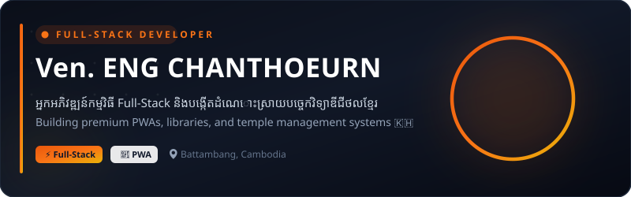

 

<table width="100%" border="0" cellpadding="0" cellspacing="0">
  <tr>
    <td width="30%" align="center" valign="top">
       
      
        
      <h3><b>វ៉ែន អេងចាន់ធឿន</b></h3>
      
<i>Ven. ENG CHANTHOEURN</i>

      
📍 Battambang, Cambodia

      
       
      
    </td>
    <td width="70%" valign="top" style="padding-left: 25px;">
       
      <h2>សួស្តី និងស្វាគមន៍មកកាន់ទំព័ររបស់ខ្ញុំ! 👋</h2>
      

        ខ្ញុំបាទជាអ្នកអភិវឌ្ឍន៍កម្មវិធី <b>Full-Stack Developer</b> ដែលមានការប្តេជ្ញាចិត្តខ្ពស់ក្នុងការស្រាវជ្រាវ និងបង្កើតដំណោះស្រាយបច្ចេកវិទ្យាឌីជីថលជាភាសាខ្មែរ។ ខ្ញុំចូលចិត្តកូដកម្មវិធីប្រភេទ <b>PWA (Progressive Web Apps)</b>, ប្រព័ន្ធគ្រប់គ្រងទិន្នន័យលើបណ្តាញវែប និងបណ្ណាល័យកូដផ្សេងៗ ដើម្បីជួយសម្រួលការងារប្រចាំថ្ងៃរបស់ស្ថាប័នអប់រំ និងសាសនានៅក្នុងប្រទេសកម្ពុជា។
      

      

        I am a dedicated <b>Full-Stack Developer</b> focused on building high-performance, localized digital solutions (PWAs, library databases, and administration systems) that empower local educational institutions, Buddhist temples, and communities in Cambodia.
      

      

      <h4>🎯 ទស្សនវិស័យ និងគោលដៅ (Vision &amp; Goals)</h4>
      <ul>
        <li>🚀 <b>Modern Web Apps:</b> អភិវឌ្ឍកម្មវិធីវែបដែលដើរលឿន ងាយស្រួលប្រើប្រាស់ និងមានសុវត្ថិភាពខ្ពស់។</li>
        <li>📱 <b>Offline-first PWAs:</b> បង្កើតកម្មវិធីដែលអាចដំណើរការបាន ទោះបីជាគ្មានប្រព័ន្ធអ៊ីនធឺណិត (Offline)។</li>
        <li>💡 <b>Open Source &amp; Education:</b> ចែករំលែកចំណេះដឹងកូដតាមរយៈ YouTube និងការបើកចំហកូដកូដជាសាធារណៈ។</li>
      </ul>
    </td>
  </tr>
</table>

---

## 🛠️ ជំនាញ និងបច្ចេកវិទ្យា (Skills &amp; Technologies)

  
  
  
  
  
  
  
  

---

## 🚀 ស្នាដៃ និងគម្រោងសំខាន់ៗ (Featured Projects)

<table width="100%">
  <tr>
    <td width="50%" valign="top">
      <h3>📚 KDLMS — បណ្ណាល័យឌីជីថលខ្មែរ</h3>
      
<b>Khmer Digital Library Management System</b>

      
ប្រព័ន្ធគ្រប់គ្រងបណ្ណាល័យឌីជីថលលំដាប់ Full-Stack (PHP/MySQL) បង្កើតឡើងជាប្រភេទ PWA (Progressive Web App) ដែលអាចដំណើរការក្រៅបណ្តាញ និងដំឡើងលើទូរស័ព្ទដៃបាន។

      

        
<b>🔍 មើលមុខងារសំខាន់ៗ (View Features)</b>

        <ul>
          <li>⚡ <b>AJAX Search:</b> ស្វែងរកសៀវភៅ ឬឯកសារភ្លាមៗដោយមិនបាច់ Reload ទំព័រ</li>
          <li>📖 <b>Multi-format Support:</b> គាំទ្រឯកសារ PDF, DOCX, EPUB និង MP4</li>
          <li>🔐 <b>Role Access Control:</b> បែងចែកគណនី Superadmin, Admin និងអ្នកអាន</li>
          <li>📊 <b>Admin Dashboard:</b> ស្ថិតិការទាញយកឯកសារ និងចំនួនអ្នកអានច្បាស់លាស់</li>
          <li>📱 <b>PWA Feature:</b> អាចដំណើរការក្រៅបណ្តាញ (Offline) និងដំឡើងប្រើប្រាស់បាន</li>
        </ul>
      

      
<i>Technologies: PHP 8.2, PDO, MySQL, Bootstrap 5.3, Service Worker, Chart.js</i>

      

        <a href="https://github.com/venengchanthoeurn-a11y/KDLMS"><b>💻 មើលកូដនៅក្នុង Repo ➔</b></a>
      

    </td>
    <td width="50%" valign="top">
      <h3>🛕 Wat Indakhilaram Thmor Koul System</h3>
      
<b>ប្រព័ន្ធគ្រប់គ្រងវត្តឥន្ទខីលារាម ថ្មគោល</b>

      
ប្រព័ន្ធគ្រប់គ្រងរដ្ឋបាល ហិរញ្ញវត្ថុ និងធនធានមនុស្សផ្ទៃក្នុងវត្តអារាមយ៉ាងទូលំទូលាយ ជួយសម្រួលការងារប្រចាំថ្ងៃរបស់ព្រះសង្ឃ និងគណៈកម្មការវត្ត។

      

        
<b>🔍 មើលមុខងារសំខាន់ៗ (View Features)</b>

        <ul>
          <li>🕌 <b>កុដិ និងព្រះសង្ឃ:</b> គ្រប់គ្រងបញ្ជីព័ត៌មាន កាលវិភាគ និងទីកន្លែងគង់នៅ</li>
          <li>📅 <b>វត្តមានព្រះសង្ឃ:</b> ប្រព័ន្ធកត់វត្តមានព្រះសង្ឃប្រចាំថ្ងៃ និងពិធីបុណ្យនានា</li>
          <li>💰 <b>ហិរញ្ញវត្ថុវត្ត:</b> កត់ត្រាចំណូល/ចំណាយ បច្ច័យបូជា និងប្រព័ន្ធគ្រប់គ្រងសប្បុរសជន</li>
          <li>🤖 <b>AI &amp; Telegram:</b> ការផ្ញើសារជូនដំណឹងស្វ័យប្រវត្តទៅ Telegram និង AI ជំនួយការវិភាគទិន្នន័យ</li>
          <li>🖨️ <b>QR Code Generator:</b> បង្កើតកាត QR Code ស្វ័យប្រវត្តសម្រាប់ព្រះសង្ឃនីមួយៗ</li>
        </ul>
      

      
<i>Technologies: PHP, MySQL, Vanilla JS/CSS, Telegram Bot API, AI Integration, TCPDF</i>

      

        <a href="https://github.com/venengchanthoeurn-a11y/wat-indakhilaram-thmor-koul"><b>💻 មើលកូដនៅក្នុង Repo ➔</b></a>
      

    </td>
  </tr>
  <tr>
    <td colspan="2" valign="top">
      <h3>📅 momentkh (បណ្ណាល័យប្រតិទិនចន្ទគតិខ្មែរ)</h3>
      
<b>Khmer Lunar Calendar utility for JavaScript</b>

      
បណ្ណាល័យកូដបន្ថែម (Add-on) លើ Moment.js ពេញនិយម ដើម្បីបំប្លែងកាលបរិច្ឆេទគ្រិស្តសករាជទៅជាថ្ងៃខែឆ្នាំចន្ទគតិខ្មែរ និងគណនាម៉ោងទេវតាចុះក្នុងឱកាសបុណ្យចូលឆ្នាំថ្មីប្រពៃណីជាតិ។

      

        
<b>🔍 មើលមុខងារសំខាន់ៗ (View Features)</b>

        <ul>
          <li>🌙 <b>បំប្លែងចន្ទគតិ:</b> បង្ហាញជាទម្រង់ខ្មែរពេញលេញ (ឧ. ថ្ងៃសៅរ៍ ៨កើត ខែមិគសិរ ឆ្នាំច សំរឹទ្ធស័ក)</li>
          <li>🎉 <b>ម៉ោងទេវតាចុះ:</b> គណនាពេលវេលាទេវតាចុះឆ្នាំថ្មីតាមក្បួនគណនាសូរិយាត្រាខ្មែរបុរាណ</li>
          <li>⚙️ <b>Custom Format:</b> អាចកំណត់ទម្រង់បង្ហាញកាលបរិច្ឆេទដោយខ្លួនឯងបានច្រើនទម្រង់ (W, d, m, a, b...)</li>
        </ul>
      

      
<i>Technologies: JavaScript (ES6), Moment.js, Soriyatra Calendar Algorithm</i>

      

        <a href="https://github.com/venengchanthoeurn-a11y/momentkh"><b>💻 មើលកូដនៅក្នុង Repo ➔</b></a>
      

    </td>
  </tr>
</table>

---

## 📊 ស្ថិតិការងារលើ GitHub (GitHub Statistics)

  
   
  

---

  <i>អរគុណសម្រាប់ការចូលមកកាន់ទំព័ររបស់ខ្ញុំ! / Thank you for visiting my profile!</i> 🙏

