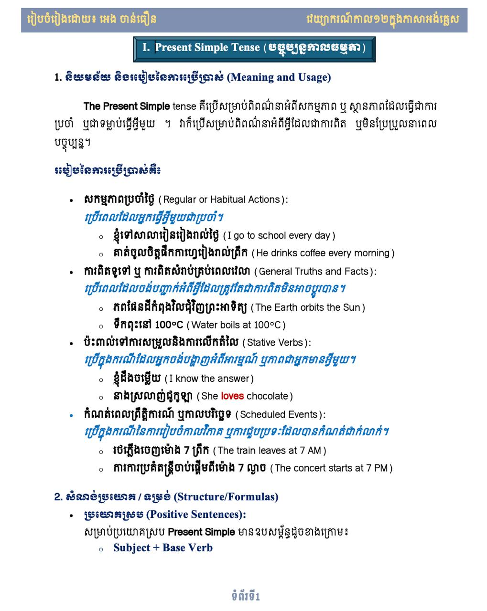

# Hi 👋, I'm Ven. ENG CHANTHOEURN

<table width="100%" border="0" cellpadding="0" cellspacing="0">
  <tr>
    <td width="75%" valign="top">
      
<b>Full-Stack Developer & Khmer Tech Solution Builder 🇰🇭</b>

      

        ខ្ញុំបាទជាអ្នកអភិវឌ្ឍន៍កម្មវិធី <b>Full-Stack Developer</b> ដែលមានចំណូលចិត្ត និងការប្តេជ្ញាចិត្តខ្ពស់ក្នុងការបង្កើតដំណោះស្រាយបច្ចេកវិទ្យាឌីជីថលជាភាសាខ្មែរ (ដូចជា PWAs, ប្រព័ន្ធគ្រប់គ្រងទិន្នន័យលើបណ្តាញវែប និងបណ្ណាល័យកូដផ្សេងៗ) ដើម្បីជួយសម្រួលដល់ការងារប្រចាំថ្ងៃរបស់សហគមន៍ ស្ថាប័នអប់រំ និងវត្តអារាមនានានៅកម្ពុជា។
      

      

        I am a passionate <b>Full-Stack Developer</b> dedicated to building localized digital solutions (PWAs, libraries, and web-based management systems) that support local communities, educational institutions, and cultural organizations in Cambodia.
      

    </td>
    <td width="25%" align="right" valign="top">
      
    </td>
  </tr>
</table>

 

- 🔭 ខ្ញុំបាទកំពុងអភិវឌ្ឍប្រព័ន្ធ **[KDLMS](https://github.com/venengchanthoeurn-a11y/KDLMS) (បណ្ណាល័យឌីជីថលខ្មែរ)** និង **[ប្រព័ន្ធគ្រប់គ្រងវត្តឥន្ទខីលារាម ថ្មគោល](https://github.com/venengchanthoeurn-a11y/wat-indakhilaram-thmor-koul)**។
- 🌱 ខ្ញុំកំពុងសិក្សាបន្ថែមលើ **PWA (Progressive Web Apps)**, **AI Agent Integration**, និង **Advanced Web Security**។
- 💬 សួរខ្ញុំអំពី **PHP (PDO)**, **MySQL**, **JavaScript (ES6+)**, **Bootstrap 5**, និង **Khmer Lunar Calendar algorithms**។
- 📫 របៀបទំនាក់ទំនងខ្ញុំ៖ **ven.engchanthoeurn@gmail.com**
- ⚡ Fact គួរឱ្យចាប់អារម្មណ៍៖ ខ្ញុំបានបង្កើតបណ្ណាល័យកូដ **[momentkh](https://github.com/venengchanthoeurn-a11y/momentkh)** សម្រាប់បំប្លែងថ្ងៃខែឆ្នាំចន្ទគតិខ្មែរ!

---

### 🌐 Socials:

  
  
  

---

### 🛠️ Tech Stack:

  
  
  
  
  
  
  
  
  
  
  
  

---

### 📊 GitHub Stats:

  
   
  

---

  <i>អរគុណសម្រាប់ការចូលមកកាន់ទំព័ររបស់ខ្ញុំ! / Thank you for visiting my profile!</i> 🙏

